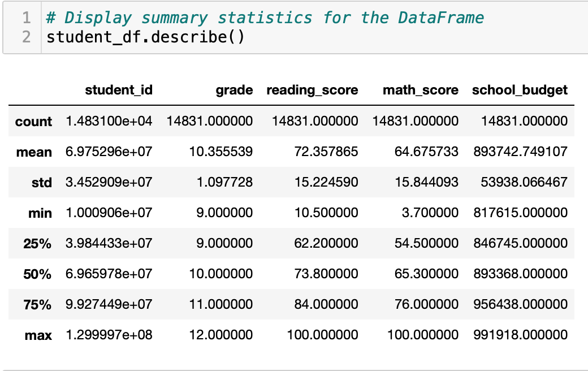
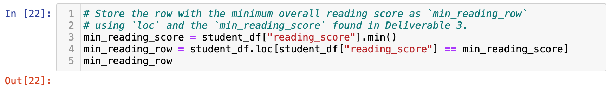
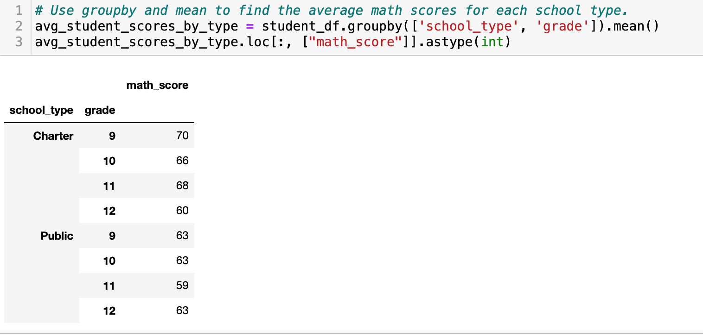

# **School_District_Analysis**
## **Purpose**
In this assignment, a cvs containing student data was analyzed to discover and make comparisons.

### **Goal**
- Create a path to the csv file and create a dataframe the student data
- Clean the dataframe
- Summarize key pieces of data
- Drill down into the data to analyze specific subsets
- Compare and contrast the data through grouping and aggregation functions

## **Resources**
- Resources: new_full_student_data.csv, 
- Code within Student Data Challenge/unsolved: Student_Data_Challenge.ipynb
- Software: pandas & jupyter notebook

## **Result Summary**
The data was summarized to show a statistical analysis of grade level, reading scores, math score, and school budgets. This showed that the average reading score was 72.4, the average math schore was 64.7 and the average budget was $893,742.

The summary was further analyzed to find the student with the lowest reading score. This showed that the lowest reading score came from a student at Dixon High School, a charter school, who scored 10.5. This score is far below the overall average reading score for all grades which is 72.4. The 11th and 12th grade have a combined reading average of 74.9 and the 9th grade has an overall reading average of 69.2

Charter schools tended to have higher math scores than Public schools, except in the 12th grade. Charter schools were lower budgets at $872,625.66 compared to Public schools at $911,195.56

Additinal analysis could be performed to better understand what this data is conveying. It would be interesting to see if the budget was an overall factor in the schools reading and math scores. This could be done my finding the the schools with the lowestest budget and checking how their reading and math scores compared to the overall averages.
